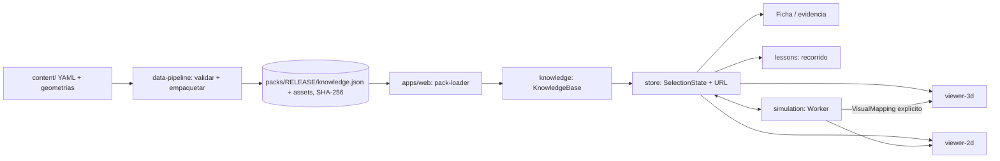

# Arquitectura de NeuroAtlas

Documento vivo. Las decisiones que lo fundamentan están en [adr/](adr/). El plan del que parte está en
[plan-original/](plan-original/) (03-arquitectura-e-interaccion.md).

## 1. Visión en una frase

Una aplicación web estática que carga **paquetes de conocimiento versionados** (entidades, afirmaciones,
evidencia, escenas, modelos) y los muestra mediante **representaciones coordinadas** (3D, 2D, fichas,
simulaciones) que comparten un único **estado de selección**.

## 2. Módulos y fronteras

| Módulo                   | Responsabilidad                                                                   | Depende de                       |
| ------------------------ | --------------------------------------------------------------------------------- | -------------------------------- |
| `packages/schemas`       | Contratos Zod; JSON Schema exportados en `packages/schemas/json/`.                | `zod`                            |
| `packages/knowledge`     | `KnowledgeBase` (índices y consultas) y `validateKnowledge` (reglas epistémicas). | schemas                          |
| `packages/simulation`    | Implementaciones de modelos, solver RK4/Euler, adaptadores Worker/en proceso.     | schemas                          |
| `packages/lessons`       | Motor de lecciones (paso → escena, foco, capas).                                  | schemas                          |
| `packages/viewer-2d`     | `TimeSeriesChart`, leyendas, escalas y color.                                     | schemas, React                   |
| `packages/viewer-3d`     | `SchematicScene` (R3F), rótulos proyectados, controles de cámara.                 | schemas, React, three, R3F, drei |
| `packages/data-pipeline` | CLI offline: `validate`, `build`, `export-schemas`, `verify-doi`.                 | schemas, knowledge, simulation   |
| `apps/web`               | Shell, store (Zustand), URL, paneles; orquesta todo lo anterior.                  | todos menos data-pipeline        |

La matriz se comprueba en CI con `tools/check-boundaries.ts`. Son paquetes de código fuente (sin paso de
compilación propio): Vite y Vitest los consumen directamente vía `exports` → `src/index.ts`.

## 3. Contratos principales

Todos en `packages/schemas/src/`. Los tipos se derivan de los esquemas (`z.infer`).

| Contrato                       | Archivo             | Notas                                                                                 |
| ------------------------------ | ------------------- | ------------------------------------------------------------------------------------- |
| `Source`                       | `knowledge.ts`      | Escalera de verificación: `candidate` → `metadata_verified` → `content_inspected`.    |
| `Context`                      | `knowledge.ts`      | Especie (o alcance general/pendiente), etapa, preparación, modalidad, atlas.          |
| `Entity`                       | `knowledge.ts`      | Solo identidad; la descripción científica vive en `Claim`.                            |
| `Relation`                     | `knowledge.ts`      | Tipada; conexiones con modalidad/dirección/signo; correspondencias con categoría.     |
| `Claim`                        | `knowledge.ts`      | Proposición acotada + evidencia + incertidumbre + estado + revisiones + procedencia.  |
| `Asset`, `SchematicGeometry`   | `representation.ts` | Licencia, naturaleza (esquema/reconstrucción…), estado (`available`/`blocked_*`).     |
| `Representation`               | `representation.ts` | Un asset en un contexto (y qué grupos de su geometría muestra).                       |
| `SceneManifest`                | `scene.ts`          | Contexto, marco de coordenadas, capas, leyenda, transiciones con puente, simulación.  |
| `Lesson`                       | `scene.ts`          | Pasos: escena, foco, capas, narrativa didáctica y afirmaciones referenciadas.         |
| `ModelSpecification`           | `model.ts`          | Ecuaciones, variables, parámetros con fuente/localizador, solver, supuestos, límites. |
| `SimulationInput/Chunk`        | `model.ts`          | Protocolo con unidades, dt, solver, semilla; chunks con unidades por variable.        |
| `SimulationAdapter`            | `model.ts`          | `describe` / `validate` / `run(input, signal)` → `AsyncIterable<SimulationChunk>`.    |
| `SelectionState`               | `pack.ts`           | Escena, contexto, entidades, capas, filtros, cursor de tiempo, comparación.           |
| `KnowledgePack`, `PackCatalog` | `pack.ts`           | Lo que publica el pipeline y carga la app.                                            |

### Identificadores

`<prefijo>.<segmento>(.<segmento>)*` en minúsculas ASCII: `src.`, `ctx.`, `ent.`, `rel.`, `claim.`,
`asset.`, `rep.`, `scene.`, `lesson.`, `model.`, `map.`. Las entidades específicas de especie llevan la
especie en el segundo segmento (`ent.human.lgn`, `ent.squid.giant_axon`); las generales usan
`ent.generic.*` o un dominio (`ent.neocortex.*`). Un ID publicado no se reutiliza (ver ADR-0003).

## 4. Modelo epistémico (cómo se evita "inventar ciencia")

- **Tipo** (`Claim.kind`): `observation`, `association`, `causal_intervention`, `inference`,
  `model_prediction`, `didactic_bridge`. **Etiqueta visible** (`display.label`): Observación, Inferencia,
  Modelo, Esquema educativo; el validador exige coherencia entre ambas.
- **Estado editorial**: `draft` → `reviewed` → `published` (o `questioned`, `retired`). `reviewed` y
  `published` exigen revisión `human_expert` aprobada, localizadores verificados y fuentes con contenido
  inspeccionado. Un release `public` solo admite contenido publicado.
- **Transparencia ≠ confianza**: la opacidad de capas es un control de visibilidad.
- Reglas completas: `packages/knowledge/src/validate.ts` (códigos de error documentados en el propio código).

## 5. Escenas, contextos y transiciones

- Cada escena tiene **un** contexto y **un** marco de coordenadas (`physical` con unidades, o `schematic`).
  Un marco esquemático solo admite assets esquemáticos/ilustraciones; uno físico no admite esquemas.
- Entre escenas, `SceneTransition` declara `correspondence` (`conceptual` hoy; `registered` exige un mapeo
  espacial, aún no implementado: WP-050), `contextChanges` y una afirmación puente (`didactic_bridge`) que la
  interfaz muestra al cambiar. Los saltos sin transición declarada también muestran las diferencias de contexto.
- Una capa cuyo asset está bloqueado no se dibuja; si todas lo están, la escena muestra el motivo, el WP, las
  fuentes candidatas y las afirmaciones consultables.

## 6. Simulación

- `ModelSpecification` (en `content/models/`) + implementación registrada (`packages/simulation/src/models/`).
  `checkSpecCompatibility` exige mismos IDs y **mismas unidades** (sin conversiones implícitas).
- Integración RK4 de paso fijo; estímulo constante a trozos con bordes alineados a `dt` (garantiza orden 4;
  ver ADR-0006). Se ejecuta en un Web Worker con chunks y cancelación; respaldo en el hilo principal.
- Verificación: convergencia temporal, comprobación cruzada RK4/Euler y **comparación con trazas de NEURON
  9.0.2** (`tools/reference/hh_neuron_reference.py` → `packages/simulation/src/fixtures/`). Esto verifica la
  ejecución numérica y la transcripción de ecuaciones, no la validez biológica (WP-012).
- El renderizado recibe resultados solo mediante `VisualMapping` declarado en la escena (p. ej. `v → color`)
  con leyenda. El reloj de pantalla nunca determina el paso de integración.

## 7. Aplicación

- **Estado**: `apps/web/src/state/store.ts` (Zustand). La lógica de navegación es pura (`state/logic.ts`) y
  se prueba en Node.
- **URL reproducible**: `r` (release), `s` (escena), `e` (entidades), `l` (capas), `lesson`/`step`, `sim`
  (protocolo). Si el release del enlace difiere, se avisa.
- **Accesibilidad**: lista HTML de estructuras como alternativa al 3D (navegable con ↑/↓/Enter), búsqueda
  (`/`), `Esc`, `[`/`]` en lecciones, botones de cámara, gráficos con descripción textual y cursor por teclado,
  movimiento reducido, colores siempre acompañados de texto, pestañas en pantallas estrechas.
- **Carga**: el visor 3D y three.js se cargan de forma diferida; sin WebGL2 la app sigue siendo usable.

## 8. Presupuesto de rendimiento

Objetivos propuestos por el plan (03, §8), a medir en los dispositivos de referencia (DEC-003, WP-036):

| Criterio                         | Objetivo           | Medido en este esqueleto (CI headless, no representativo) |
| -------------------------------- | ------------------ | --------------------------------------------------------- |
| Bundle inicial comprimido        | ≤ 2 MB             | 122 KB gzip (JS) + 4 KB (CSS)                             |
| Chunk 3D diferido                | —                  | 248 KB gzip                                               |
| Conocimiento del release         | —                  | 93 KiB (`knowledge.json`)                                 |
| Transición precargada            | crossfade ≤ 750 ms | 450 ms (desactivado con movimiento reducido)              |
| Simulación HH 100 ms, dt 0,01 ms | —                  | ~0,1 s en Worker (swiftshader headless)                   |

## 9. Cómo extender

- **Nueva afirmación**: añadirla en `content/claims/*.yaml` como `draft`, con `evidence` (fuente existente o
  nueva en `content/sources/`). `npm run validate`.
- **Nueva escena**: contexto (si es nuevo) → asset + archivo de geometría → representación(es) → manifiesto en
  `content/scenes/` con leyenda y transiciones con puente. El validador comprueba coherencias.
- **Nuevo modelo**: implementación en `packages/simulation/src/models/` registrada en `registry.ts`, ficha en
  `content/models/`, referencia independiente y pruebas (ver WP-040 y ADR-0006).
- **Nuevo tipo de asset** (malla GLB, SWC): requiere ADR y WP de visor/pipeline (WP-022, WP-023).
