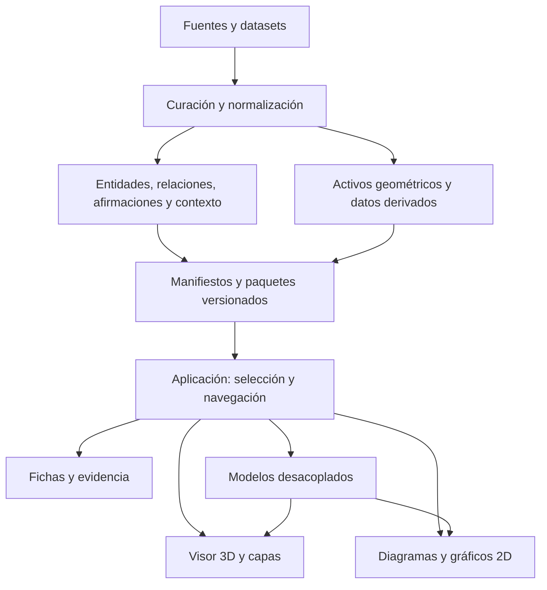

# NeuroAtlas: plan maestro de un entorno multiescala de neurociencia

**Versión:** propuesta inicial, 4 de octubre de 2026. **Público inicial confirmado:** estudiantes avanzados y docentes. **Forma de ejecución confirmada:** una persona con Claude y otros modelos, más asesores puntuales. NeuroAtlas es un nombre de trabajo, pendiente de comprobar antes de usarlo públicamente.

## 1. Qué construir y qué hace viable la idea

Construir un entorno de exploración y aprendizaje que conecte anatomía, conectividad, organización celular y modelos computacionales. El producto central es una **base de conocimiento científica versionada con representaciones interactivas**. Su interfaz permite explorar el sistema nervioso, seleccionar estructuras, encender capas, seguir vías, cambiar de escala y experimentar con modelos delimitados.

La experiencia puede tener superficies transparentes, cortes, conexiones y transiciones suaves. Su valor docente surge de que cada elemento visual responde a una pregunta y permite examinar su evidencia. No hace falta que toda información tenga una representación 3D: matrices, diagramas de circuitos, señales y ecuaciones suelen explicar mejor determinados fenómenos.

Hay tres trabajos relacionados que deben avanzar juntos:

1. **Organizar y verificar conocimiento:** entidades, relaciones, afirmaciones, contexto y fuentes.
2. **Representarlo y navegarlo:** geometría, diagramas, capas, selección coordinada y transiciones entre escenas.
3. **Experimentar con mecanismos:** modelos con ecuaciones, entradas, resultados, supuestos y límites explícitos.

La ambición se sostiene al ampliar unidades que comparten estos contratos. Comenzar intentando integrar todas las fuentes, escalas y teorías impediría saber si la arquitectura y la experiencia funcionan. La primera entrega debe demostrar un recorrido científico completo y pequeño; después crecer por módulos.

## 2. Lo que verá y hará el usuario

Una pantalla de escritorio combina explorador de niveles/capas, visor, ficha científica y gráficos. En móvil usa pestañas y conserva la selección. Al elegir V1, por ejemplo, el usuario puede localizarla en el atlas, inspeccionar una vía visual, abrir un esquema laminar, seleccionar una población y consultar afirmaciones y fuentes. La información cambia según la representación y el contexto.

La ficha tiene profundidad progresiva:

- **Identidad y orientación:** nombre, sinónimos, ubicación, especie, atlas, escala y qué representa la imagen.
- **Organización:** partes, capas, tipos celulares y relaciones conocidas en ese contexto.
- **Conectividad:** origen/destino, modalidad de medición, direccionalidad disponible y alcance.
- **Dinámica y función:** variables registradas, tareas, estados y resultados; separar asociación de causalidad.
- **Interpretación computacional:** operación propuesta, modelo, ecuaciones, supuestos y predicciones examinables.
- **Evidencia y discusión:** referencias, localizadores, limitaciones, resultados discrepantes, revisión y preguntas abiertas.

Hover y foco ofrecen un adelanto; clic, toque y teclado abren información persistente. Buscar, volver atrás, fijar una selección y compartir un estado deben funcionar desde el primer módulo. Una persona que no pueda usar el visor debe acceder a la información mediante listas, texto y diagramas.

Dos modos comparten los mismos datos: **exploración libre** y **recorridos guiados**. Un docente puede llevar al grupo por escenas, guardar un estado y proponer un experimento. Guardar archivos/URLs basta al inicio; cuentas, cursos compartidos y colaboración pueden añadirse cuando haya uso que los justifique.

## 3. Organizar escalas y dimensiones

La jerarquía anatómica sirve para orientarse. El resto requiere un grafo: una región puede pertenecer a varias redes, una capacidad usar sistemas distribuidos y una célula recibir etiquetas de varias taxonomías. Las clasificaciones se mantienen con autor, versión, alcance y correspondencias verificadas.

| Recorrido espacial | Preguntas y representaciones |
|---|---|
| Organismo y sistema nervioso | SNC/SNP, sistema autónomo, médula y relación cuerpo–ambiente; mapa anatómico y vías. |
| Regiones y sistemas | Surcos, giros, núcleos, parcelaciones, redes y conexiones; superficies, cortes y matrices. |
| Organización local | Citoarquitectura, capas, poblaciones y microcircuitos; diagramas y datos histológicos. |
| Célula y conexiones | Taxonomías, morfología, sinapsis, excitabilidad y glía; reconstrucciones y gráficos. |
| Compartimentos y mecanismos | Membrana, canales, receptores, plasticidad y procesos subcelulares; esquemas y simulaciones. |

El tiempo constituye un eje independiente: disparos, oscilaciones, integración, conducta, aprendizaje y desarrollo tienen ventanas distintas. Mostrar **tiempo biológico/modelado**, **muestreo** y **velocidad de animación** por separado. Cambiar la reproducción a cámara lenta no modifica el fenómeno ni la simulación.

Filtros independientes: especie; muestra/edad; anatomía; vía; función operacionalizada; escala espacial; escala temporal; método; modelo; estatus de evidencia y versión. Un resultado fMRI y una reconstrucción de microscopía electrónica pueden referirse a regiones relacionadas, pero su resolución y su inferencia son diferentes.

## 4. Principios que debe preservar toda implementación

1. Cada estructura, relación científica, gráfico y modelo mantiene procedencia y contexto. Los valores desconocidos se registran como desconocidos.
2. Una flecha distingue proyección anatómica, conexión sináptica, relación funcional, inferencia efectiva y vínculo conceptual. La ausencia de una arista no demuestra ausencia de conexión.
3. Cada transición declara si es un cambio de escala con registro espacial, un cambio de dataset o un puente conceptual. El acabado visual no debe ocultar cambios de especie o abstracción.
4. Las etiquetas «observación», «inferencia», «modelo» y «esquema educativo» permanecen accesibles. La transparencia es un control de visibilidad; no una medida de confianza.
5. Los datos y afirmaciones viven fuera de los componentes de interfaz. Corregir una afirmación no exige reconstruir la aplicación.
6. Las unidades publicadas requieren revisión humana delimitada. Dos modelos de lenguaje pueden revisar entre sí, pero no constituyen validación experimental ni evaluación experta.
7. Las geometrías, modelos y diagramas tienen licencia y atribución propias. Un artículo accesible no concede automáticamente permiso sobre cualquier recurso asociado.
8. Un modelo ejecutable especifica ecuaciones, unidades, parámetros, solver, condiciones iniciales, observables y alcance. El reloj del renderizador nunca determina el paso de integración.

Las teorías predictivas merecen un espacio central por su interés computacional, con comparaciones y experimentos. Deben distinguirse codificación predictiva, procesamiento predictivo, inferencia activa y propuestas de alostasis/interocepción/construcción de emoción. Presentar sus puntos de contacto junto a sus diferencias y evidencia. Las asignaciones de predicción/error a capas o neuronas son afirmaciones contextuales que requieren fuente, no convenciones anatómicas universales.

## 5. Primer módulo: vía visual y excitabilidad

**Pregunta general:** ¿cómo se organiza la ruta de información visual hacia la corteza y qué puede enseñarnos un modelo de excitabilidad sobre la generación de un potencial de acción?

El módulo contiene cinco escenas: vía retina–quiasma–LGN–V1; localización anatómica de V1; circuito laminar contextualizado; célula/morfología; y experimento de excitabilidad. El circuito cortical y el modelo celular tienen sus propias fuentes. Hodgkin–Huxley clásico ilustra un mecanismo en su contexto de axón gigante de calamar; su presencia al final del recorrido no lo convierte en un modelo parametrizado de una neurona cortical humana.

Objetivos docentes verificables:

- Localizar estaciones y lateralidad de la vía visual, distinguiendo el diagrama pedagógico de una reconstrucción experimental.
- Explicar qué representa una conexión y reconocer cuándo cambian especie, dataset o nivel de abstracción.
- Manipular corriente de entrada y observar potencial/corrientes en un modelo documentado, relacionando resultados con sus supuestos.

**Alcance inicial:** cinco escenas pequeñas, aproximadamente 15–25 afirmaciones revisadas, una ficha científica por elemento principal, selección coordinada, controles de capas, un recorrido guiado y una simulación reproducible. El número de afirmaciones se amplía si el contenido publicado lo exige; no es un límite que permita dejar texto sin soporte.

**Comprobación del producto:** un docente puede recorrerlo en 10–15 minutos; un estudiante puede repetir un experimento y consultar las fuentes; todas las acciones esenciales funcionan con teclado y toque. El rendimiento se mide con hardware, navegador y red definidos. La primera unidad no pretende simular todo el procesamiento visual.

Si las geometrías disponibles no permiten esta vía con suficiente calidad y derechos, se reduce el recorrido o se usa un esquema rotulado. No se introduce anatomía inventada para mantener una promesa estética.

## 6. Arquitectura recomendada y crecimiento

Para el inicio: React/TypeScript, Three.js mediante React Three Fiber y WebGL2, diagramas/gráficos 2D, estado compartido y simulaciones pequeñas en Workers. Los datos se curan offline y distribuyen en paquetes estáticos versionados, con carga diferida. Postgres/FastAPI y motores remotos se incorporan cuando haya una necesidad demostrable.

Separar núcleo científico, pipeline de datos, representaciones, simulación, lecciones e interfaz dentro de un proyecto modular. Las interfaces iniciales son `Entity`, `Claim`, `Relation`, `Representation`, `SceneManifest`, `SelectionState`, `ModelSpecification` y `SimulationAdapter`. Los tipos del documento técnico son bocetos; Claude debe cerrarlos como esquemas validables, documentar convenciones y probarlos con ejemplos antes de programar vistas. `Claim` es el nombre canónico recomendado para «afirmación».

Reutilizar infraestructura existente: atlas humanos y plataformas EBRAINS/Jülich, recursos de Allen, Neuroglancer para volúmenes, repositorios de morfología y ModelDB/NEURON/Brian2 para modelos cuando corresponda. La elección se hace por formato, versión, licencia y pregunta docente. El MVP descarga subconjuntos adecuados; no copia conectomas masivos al navegador ni reconstruye todas esas plataformas.

Un futuro asistente conversacional puede responder a partir de afirmaciones revisadas y citar sus IDs/fuentes. Se añade después de tener una base confiable y evaluaciones de respuestas. El primer producto debe funcionar sin generación de explicaciones nuevas en tiempo real.

## 7. Ruta de expansión científica

| Unidad | Valor docente y computacional | Qué debe estar resuelto antes |
|---|---|---|
| Vía visual y excitabilidad | Demuestra navegación, circuito y modelo celular | Procedencia, escenas, selección, parámetros y revisión del primer módulo. |
| Hipocampo y navegación | Anatomía, células de lugar/cuadrícula, secuencias y modelos de navegación | Separar especies/tareas, datos de conducta y modelos; no equiparar una simulación con mecanismo humano demostrado. |
| Control motor | Bucles cortico–subcorticales, cerebelo, médula y control | Circuitos contextualizados; modelo de control con variables y alcance declarado. |
| Interocepción y alostasis | Relación cuerpo–cerebro, sistema autónomo e interpretaciones predictivas | Fuentes multimodales; evaluación de inferencias y contraste de propuestas. |
| Microcircuitos y tipos celulares | Diversidad laminar, inhibición, conectómica y clasificación | Contextos regionales, taxonomías versionadas y correspondencias entre modalidades. |
| Plasticidad, desarrollo y sistemas más amplios | Escalas lentas, aprendizaje y evolución de organización | Marco temporal y versiones de modelos; expansión de cobertura con asesores por dominio. |

Este orden es una recomendación. Después del piloto se decide la siguiente unidad según demanda docente, disponibilidad de datos y coste de revisión. Las redes predictivas pueden aparecer primero como una comparación de modelos visuales sencillos; un mapa interoceptivo amplio puede requerir más curación.

## 8. Equipo, fases y responsabilidades

Tú conservas dirección y decisiones docentes. Claude integra arquitectura, contratos y entregas. Modelos más simples reciben paquetes acotados: extraer una tabla verificada, preparar un manifiesto, implementar un componente o comprobar referencias. Los asesores humanos revisan decisiones donde un error cambiaría el significado científico.

Reclutamiento inicial prioritario: **neuroanatomía/neurofisiología de la vía elegida** y **neurociencia computacional**. Contratar revisión de un artefacto y preguntas concretas, con horas y entregable. Añadir un generalista web/3D si aparecen obstáculos de geometría/rendimiento; docentes y estudiantes participan en el piloto. Un equipo permanente de especialistas se justifica al ampliar dominios y uso.

La fase de preparación decide corpus y assets; la fase de base cierra contratos y procedencia; el desarrollo entrega el recorrido integrado; el piloto observa tareas y corrige errores. La referencia de planificación para una alfa docente revisada es **3–5 meses a dedicación parcial**, con variación por disponibilidad de fuentes y asesores. Es una estimación, no una promesa. Los presupuestos del documento de ejecución son supuestos orientativos que deben contrastarse localmente.

En cada iteración, Claude entrega un resultado revisable y el siguiente paquete. Mantener un backlog ordenado por dependencias, con objetivo, archivos, entradas, salidas, aceptación, responsable y dudas. Las mejoras visuales se prueban sobre el recorrido real y compiten con su coste de mantenimiento y beneficio educativo.

## 9. Investigación y mantenimiento

La investigación se divide en fundamentos, datos y debates. Kandel orienta fundamentos con edición y capítulos explícitos. El título del manual de neurociencia computacional que mencionaste sigue pendiente; como candidatos complementarios pueden evaluarse Dayan–Abbott y Gerstner y colaboradores, sin asumir que sean el libro que tienes en mente. Revisiones y estudios primarios permiten examinar resultados actuales y controversias.

Cada unidad tendrá un protocolo: pregunta, especies, métodos, repositorios, cadenas de búsqueda, intervalo temporal, criterios de inclusión/exclusión, accesos ausentes y fecha de corte. Una tabla de cobertura registra qué se revisó, qué queda pendiente y qué se publicó. Cada afirmación tiene fuente y localizador comprobados, límites de generalización y revisión. Extraer una cita de un índice bibliográfico no equivale a haber leído y verificado el artículo.

La vigilancia puede ejecutarse mensualmente sobre temas activos y revisarse trimestralmente por unidad; cadencia propuesta a ajustar al presupuesto. Nuevos papers, correcciones, retractaciones y releases de datasets generan propuestas de cambios. La publicación sigue siendo una decisión editorial versionada. No prometer «toda la neurociencia actualizada»: mostrar cobertura y fecha efectiva de revisión.

## 10. Riesgos principales y respuesta concreta

| Riesgo | Respuesta de diseño |
|---|---|
| Crecimiento del alcance antes de tener una unidad útil | Cerrar primer recorrido y piloto; expansión por paquetes y preguntas docentes. |
| Falsa continuidad entre escalas/especies | Manifiestos de contexto, puentes conceptuales y transición rotulada. |
| Visualizaciones que exageran evidencia | Tipos de relación y etiquetas; auditoría científica de lo que comunica la imagen. |
| Licencias o assets insuficientes | Inventario previo; originales/derivados separados; esquema declarado o reducción de alcance. |
| Taxonomías y atlas incompatibles | Clasificaciones versionadas; correspondencias explícitas e incertidumbre. |
| Conectomas/volúmenes demasiado grandes | Subconjuntos, multirresolución y visores especializados con adaptadores. |
| Código generado difícil de integrar | Contratos estables, paquetes pequeños, ADR y verificaciones del recorrido. |
| Mantenimiento científico insostenible | Cobertura declarada, fuentes fechadas, backlog y releases; corpus inicial pequeño. |
| Belleza visual sin aprendizaje | Tareas y explicaciones evaluadas con usuarios; gráficos adecuados al fenómeno. |

## 11. Próxima entrega que debe pedir el usuario a Claude

Entregar este dossier y usar el prompt maestro de `04-ejecucion-y-prompts.md`. La primera ejecución debe producir decisiones arquitectónicas, esquemas validables, inventario real de fuentes/assets y backlog del módulo visual; luego avanzar al camino mínimo integrado. Los documentos de este paquete son un plan, no una aplicación implementada ni un corpus científicamente validado.

Decisiones aún abiertas: edición de Kandel y manual computacional; dispositivos objetivo; horas semanales; límite de gasto; primera geometría autorizada y especie/dataset para el circuito local. Se pueden preparar contratos e inventarios mientras se resuelven. La primera inversión valiosa es revisar el recorrido y la evidencia con un asesor, antes de extender el catálogo.
