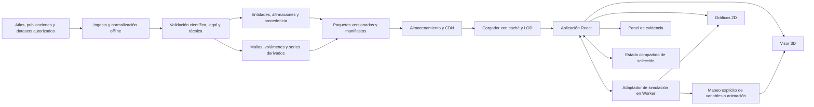

# Arquitectura e interacción del atlas

## 1. Decisión central

Construir una aplicación web de estudio y enseñanza que coordine representaciones anatómicas, circuitos, gráficos y modelos computacionales mediante identificadores y evidencia compartidos. Una malla 3D, un grafo de conexiones y una simulación tienen contratos distintos; vincularlos exige declarar qué correspondencia existe.

La primera versión sirve a estudiantes avanzados y docentes. La mantiene una persona con Claude y otros modelos, apoyada por asesores científicos puntuales. Por ello conviene un repositorio modular, pocos servicios y una primera experiencia educativa completa antes de añadir atlas o motores.

El principio científico es **navegación entre representaciones con contexto visible**. La apariencia futurista puede mejorar la exploración, pero una transición visual nunca acredita una continuidad anatómica, una conexión experimental ni equivalencia entre especies.

## 2. Arquitectura técnica inicial

- **Interfaz:** React, TypeScript y Vite; controles HTML accesibles alrededor del visor.
- **3D:** Three.js mediante React Three Fiber; WebGL2 como base. WebGPU será una mejora posterior, tras comprobar compatibilidad, transparencia y dispositivos reales. No debe ser requisito del MVP.
- **2D:** SVG/Canvas para diagramas y una biblioteca de gráficos científicos para potenciales, tasas, matrices y curvas. Elección final tras probar selección coordinada y accesibilidad.
- **Estado:** store ligero, como Zustand, con un único contrato de selección; parámetros reproducibles en URL y exportación JSON.
- **Distribución:** aplicación estática y paquetes de datos versionados en almacenamiento/CDN. Caché por hashes; descargar cada escena cuando se necesita. Sin service worker inicial salvo necesidad real de uso sin conexión.
- **Simulación:** Web Workers para modelos pequeños; adaptadores posteriores para ejecuciones remotas.

El repositorio debe separar `schemas`, `knowledge`, `data-pipeline`, `viewer-3d`, `viewer-2d`, `simulation`, `lessons` y `app`. Es una separación de responsabilidades dentro de un proyecto, sin crear ocho microservicios.



Añadir **Postgres y FastAPI solamente cuando exista una necesidad concreta**: cuentas y anotaciones compartidas, catálogo demasiado grande para descargar sus índices, consultas complejas o simulaciones persistentes. Postgres basta inicialmente para entidades, relaciones, afirmaciones y JSON; un motor especializado de grafos se evalúa con consultas y tamaño reales. Los datos volumétricos y mallas siguen en almacenamiento de objetos.

## 3. Modelo científico y separación de responsabilidades

El grafo de conocimiento describe significado y procedencia; el grafo de una escena describe objetos visibles. No son intercambiables.

| Objeto | Responsabilidad |
|---|---|
| `Entity` | Identidad estable: región, población, tipo celular, canal, modelo o capacidad funcional. |
| `Claim` | Proposición contextualizada: texto, fuente, especie, método, alcance, fecha y revisión. |
| `Relation` | Relación tipada: `part_of`, `projects_to`, `expresses`, `modeled_by`, etc.; vinculada a afirmaciones. |
| `Representation` | Malla, volumen, diagrama, serie o morfología de una entidad en un contexto específico. |
| `SceneManifest` | Qué cargar, cómo situarlo y qué interacciones ofrecer. |
| `Lesson` | Recorrido, objetivos, explicaciones y preguntas sobre las escenas. |

Una conexión registra dirección, modalidad y alcance: tractografía, trazado, sinapsis reconstruidas o relación funcional, entre otras. El grosor del trazo sólo codifica una magnitud declarada y comparable. Una correlación funcional no se convierte en proyección axonal.

Toda representación debe declarar especie, etapa, preparación, modalidad, atlas y versión, marco de coordenadas, unidades, resolución y procedencia. Las transformaciones espaciales llevan método y error cuando se conoce. Separar tiempo del experimento, tiempo del modelo y tiempo de la animación.

Entre contextos usar relaciones explícitas como `conceptual_analogy`, `homology_candidate` o `registered_to`. Una relación de identidad requiere justificación. Los enlaces con NeuroNames, terminologías de Allen u otras ontologías se verifican individualmente; conservar nombres originales y sinónimos.

La navegación anatómica puede usar una jerarquía, pero circuitos, funciones y taxonomías necesitan relaciones múltiples. Una región participa en varias vías y capacidades; «memoria» no es una subdivisión anatómica del hipocampo. Los filtros de especie, sistema, función, escala espacial y escala temporal son dimensiones separadas. Sus rangos se declaran por representación o modelo, sin imponer una escala temporal universal a una estructura.

La incertidumbre no es un número inventado. Mostrar estados descriptivos: observado en este dataset, agregado de estudios, modelo propuesto, esquema educativo y correspondencia entre contextos. Un cálculo probabilístico sólo recibe valor numérico si tiene método documentado.

## 4. Contratos mínimos

Los siguientes tipos son un diseño inicial; se validan con JSON Schema/Zod y ejemplos antes de implementar componentes. Los valores numéricos necesitan unidades, y los identificadores referencian registros resolubles.

```ts
type SceneManifest = {
  schemaVersion: string;
  sceneId: string;
  release: string;
  title: string;
  contextId: string; // especie, atlas, método y marco de coordenadas
  semanticScale: "organism" | "system" | "pathway" | "region" |
    "circuit" | "cell" | "subcellular" | "molecular";
  coordinateFrame:
    | { kind: "physical"; id: string; units: "m" | "mm" | "um" | "nm"; axes: string }
    | { kind: "schematic"; id: string; units: "arbitrary"; axes: string };
  layers: Array<{
    id: string;
    entityIds: string[];
    representationId: string;
    kind: "mesh" | "volume" | "morphology" | "graph" | "schematic";
    assetRef: string; // resuelve URL, hash, bytes, formato y licencia
    lodRefs: string[];
    evidenceIds: string[];
    defaultVisible: boolean;
  }>;
  transitions: Array<{
    targetSceneId: string;
    bridgeClaimId: string;
    correspondence: "registered" | "conceptual";
    contextChanges: Array<"species" | "dataset" | "atlas" | "modality" | "abstraction">;
    spatialMappingId?: string; // obligatorio si corresponde a un registro espacial
  }>;
};

type SelectionState = {
  sceneId: string;
  contextId: string;
  selectedEntityIds: string[];
  focusedRepresentationId?: string;
  visibleLayerIds: string[];
  filters: Record<string, string[]>;
  timeCursor?: { runId: string; value: number; units: "ms" | "s" };
  compareWith?: { sceneId: string; contextId: string };
};

type SimulationAdapter = {
  modelId: string;
  modelVersion: string;
  describe(): Promise<ModelSpecification>;
  validate(input: SimulationInput): ValidationResult;
  run(input: SimulationInput, signal: AbortSignal):
    AsyncIterable<SimulationChunk>;
};
```

`ModelSpecification` declara ecuaciones, parámetros y dominios, unidades, hipótesis, fuente, contexto biológico y observables. `SimulationInput` contiene protocolo, condiciones iniciales, duración, paso o tolerancia, solver y semilla. `SimulationChunk` identifica ejecución, ejes, unidades y variables. Exportar estos metadatos junto con los resultados.

El adaptador no conoce cámaras, materiales ni objetos de Three.js. El renderizador recibe resultados mediante un mapeo explícito, por ejemplo `V_m → color de membrana`, con leyenda. La simulación avanza por su reloj y solver; la pantalla interpola muestras. Reducir FPS no modifica la solución numérica.

## 5. Pipeline de datos y reutilización

Mantener originales y derivados separados; no transformar un archivo sin preservar su contexto.

1. **Adquirir:** URL o DOI, versión, licencia del dato y del recurso gráfico, restricciones, checksums y fecha. Una API accesible o un paper abierto no conceden automáticamente redistribución de todos sus activos.
2. **Normalizar:** IDs, nombres, unidades, ejes, especie y vocabularios. Nunca asumir que dos atlas comparten coordenadas.
3. **Derivar offline:** geometría, niveles de detalle, teselas, índices y subconjuntos educativos.
4. **Validar:** orientación, escala, integridad, etiquetas, relaciones y revisión científica del subconjunto publicado.
5. **Empaquetar:** manifest, datos de conocimiento, activos, atribuciones y reporte de validación.
6. **Publicar release inmutable:** el catálogo apunta a una versión; actualizar produce otra release y un registro de cambios.

| Fuente/formato | Tratamiento para el navegador |
|---|---|
| NIfTI y superficies GIFTI | Conservar originales; derivar superficies glTF/GLB y volúmenes multirresolución cuando aporten valor. |
| Mallas OBJ/PLY/STL | Revisar escala y orientación; crear GLB y LOD, compresión según compatibilidad comprobada. |
| Morfologías SWC | Preservar topología y radios; generar buffers o instancias, sin miles de objetos individuales. |
| Conectividad CSV/Parquet | Normalizar nodos y evidencias; precomputar agregaciones y vecindarios por región/contexto. |
| NWB/HDF5 y series | Extraer vistas o chunks autorizados con metadatos; evitar cargar un archivo experimental completo. |
| Volúmenes extensos | Elegir formato multiescala compatible, como Neuroglancer precomputed u OME-Zarr según origen y visor. |

Reutilizar recursos existentes antes de recrear sus capacidades: [Neuroglancer](https://github.com/google/neuroglancer) para explorar volúmenes enormes; [EBRAINS](https://ebrains.eu/) como fuente de atlas y servicios; [Allen Brain Map](https://portal.brain-map.org/) para recursos anatómicos y celulares; [NEURON](https://www.neuron.yale.edu/neuron/) o [Brian2](https://brian2.readthedocs.io/) para modelos posteriores que lo justifiquen. Son candidatos sujetos a términos, formatos y cobertura científica.

Primero enlazar la vista externa con contexto e identificadores. Incorporar un visor mediante adaptador o incrustación sólo tras comprobar CORS, licencia, navegación, rendimiento y seguridad. Evitar importar una plataforma completa al bundle inicial. No depender de una API remota para que funcione la lección básica.

## 6. Interacción y lenguaje visual

La pantalla coordina cuatro áreas: mapa de niveles y capas; visor anatómico; panel de entidad/evidencia; gráficos o diagramas 2D. En móvil pasan a pestañas con selección persistente. Elegir una región actualiza texto, grafo y gráficos; elegir una curva o nodo localiza la representación pertinente.

**Capas:** superficies y pliegues, parcelación, vías, conectividad, organización laminar y etiquetas. Mostrar compatibilidad por contexto. El usuario puede alterar opacidad, recorte y visibilidad, pero algunas capas requieren escenas distintas. La transparencia excesiva dificulta profundidad y cuesta rendimiento; ofrecer también cortes, contornos y vistas separadas.

**Zoom semántico:** el zoom geométrico acerca una representación. Cambiar de escala abre otra escena al cruzar un umbral explícito o elegir «Explorar circuito». Precargar la escena de destino; hacer crossfade breve, conservar la selección conceptual cuando corresponda y mostrar el cambio de especie/dataset/modelo. Sólo usar cámara espacial continua cuando exista registro válido. Permitir volver al contexto anterior y reconstruir el recorrido mediante URL.

**Accesibilidad:** hover muestra adelantos opcionales; clic, toque y teclado permiten las mismas acciones. Cada entidad tiene equivalente en una lista HTML; foco visible, búsqueda, etiquetas y navegación por Tab. Controles de cámara disponibles como botones; modo de movimiento reducido; leyendas con texto además de color. Los tooltips no contienen la única información disponible. No exigir gestos precisos ni pulsación prolongada.

Si WebGL2 no está disponible, conservar diagramas 2D, etiquetas, evidencia y recorridos de estudio. La información científica esencial debe seguir siendo accesible.

**Evidencia:** el panel explica qué se observa, cómo se obtuvo, qué propone el modelo y qué queda abierto. Líneas discontinuas, rótulos y símbolos distinguen modelos y vínculos contextuales; reservar opacidad para visibilidad si usarla para incertidumbre resulta ambiguo. Cada gráfico declara ejes, unidades, normalización y contexto.

## 7. Primer bloque vertical: retina → LGN → V1 → circuito → célula

Crear cinco escenas pequeñas conectadas por una pregunta: **¿cómo una señal visual llega a una representación cortical y cómo se expresa la excitabilidad de una neurona?**

1. **Vía visual:** retina, nervio/quiasma, tracto óptico, LGN y V1; etiquetas, lateralidad y campo visual mediante un diagrama 2D.
2. **V1 anatómica:** localización en una representación humana identificada y relación con superficies/cortes. Añadir retinotopía sólo con fuente y correspondencia declaradas.
3. **Circuito laminar:** esquema de poblaciones y entradas; especie, región y límites explícitos. No presentar un circuito canónico como descripción idéntica de toda corteza.
4. **Célula/morfología:** una reconstrucción documentada o un esquema rotulado, con dendritas, soma y axón. Una tipología molecular no determina automáticamente esa morfología ni todos sus parámetros eléctricos.
5. **Excitabilidad:** experimento reproducible con corriente y potencial de membrana. Hodgkin–Huxley clásico puede ilustrar el potencial de acción, indicando su origen en axón gigante de calamar y su carácter pedagógico en este recorrido; un modelo cortical exige parametrización y validación adicionales.

Las flechas de tránsito tienen explicación. Pasar de anatomía humana a microcircuito de ratón o al HH clásico es un puente conceptual, visible antes y después de la transición. Esta primera lección no simula todo el procesamiento retina–V1: cada modelo tiene entradas y salidas delimitadas. Las animaciones de propagación son didácticas salvo que procedan de una ejecución explícita.

## 8. Escalabilidad y aceptación

Nunca enviar al navegador un conectoma completo con cientos de millones o miles de millones de aristas. Mostrar agregados, filtros, vecindarios y subconjuntos con tamaños visibles. Usar instancias, índices espaciales, carga diferida, cancelación y eliminación de buffers al abandonar escenas. Limitar etiquetas por pantalla y evitar recalcular grafos durante cada frame. En móvil reducir LOD, resolución y capas transparentes.

Los siguientes son **presupuestos propuestos para medir y ajustar, no resultados garantizados**. Registrar hardware, navegador, resolución y release en cada informe. Referencia inicial: portátil con i5 de 11.ª generación, Iris Xe y 16 GB, Chrome estable, viewport 1440×900; móvil Pixel 7 con Chrome estable y viewport 390×844. Red controlada: 20 Mbps, 80 ms de latencia; probar caché vacía y caliente.

| Criterio del primer bloque | Objetivo inicial verificable |
|---|---|
| Bundle inicial comprimido | ≤ 2 MB; activos de primera escena ≤ 15 MB escritorio / 8 MB móvil. |
| Primera escena utilizable | ≤ 8 s en la red definida, sin esperar las cinco escenas. |
| Navegación y selección | Respuesta visual p95 ≤ 100 ms; detalle básico disponible durante la carga de recursos. |
| Render de escena de referencia | Tiempo de frame p95 ≤ 20 ms escritorio / 33 ms móvil durante 60 s de recorrido definido. |
| Geometría y grafo visibles | Presupuesto inicial: 300.000/100.000 triángulos y 5.000/1.000 aristas escritorio/móvil; ajustar según medidas. |
| Transición precargada | Crossfade ≤ 750 ms; controles utilizables y opción de movimiento reducido. |
| Descarga y memoria | Cancelar cargas obsoletas; tras precargar un recorrido, repetirlo diez veces: heap estabilizado y bytes GPU estimados ≤ 110% de la línea base, con idéntica escena final. |
| Exactitud y procedencia | Toda entidad mostrada resuelve contexto y fuente; ninguna correspondencia entre especies queda implícita. |
| Simulación | Comparación contra solución de referencia con tolerancia numérica declarada; cancelar y exportar parámetros/resultados. |
| Accesibilidad y reproducibilidad | Recorrido completo por teclado y toque; URL/JSON restaura escena, capas y selección; advertencia si cambia la versión. |

El criterio de cierre es una lección revisable y reproducible, no el número de efectos visuales. La expansión añade datasets y experiencias a estos contratos sin convertir cada bloque en una aplicación independiente.
