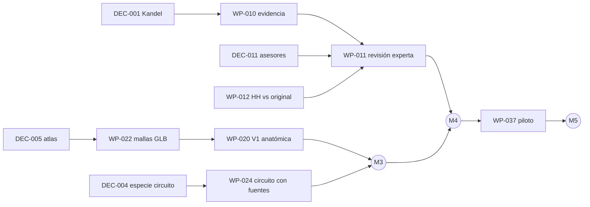

# Hoja de ruta

Basada en las fases del plan ([plan-original/04-ejecucion-y-prompts.md](plan-original/04-ejecucion-y-prompts.md)
§2). Los plazos son estimaciones de trabajo humano a dedicación parcial; generar código rápido no elimina
curación, revisión ni validación. El detalle de cada tarea está en [backlog.md](backlog.md).

## Dónde estamos (2026-10-04)

| Fase               | Estado                    | Qué falta para la condición de avance                                                                                                                                                                                                |
| ------------------ | ------------------------- | ------------------------------------------------------------------------------------------------------------------------------------------------------------------------------------------------------------------------------------ |
| 0. Acotar          | **En curso**              | Decisiones DEC-001…011; licencia del primer asset anatómico; inventario de assets verificado.                                                                                                                                        |
| 1. Base            | **Técnicamente completa** | Arquitectura, esquemas validables, ADR, validador, prototipo de navegación y simulación: hechos. Falta: revisión humana de ingeniería (WP-005) y que las 25 afirmaciones pasen de "redactadas" a "curadas con localizador" (WP-010). |
| 2. Unidad vertical | No iniciada               | Geometría anatómica real (WP-020), circuito con especie decidida (WP-024), evidencia revisada (WP-011, WP-012), mediciones (WP-036).                                                                                                 |
| 3. Piloto          | No iniciada               | Observación con docentes y estudiantes (WP-037).                                                                                                                                                                                     |
| 4. Ampliar         | Futuro                    | Una unidad por ciclo de 2–4 semanas.                                                                                                                                                                                                 |

**La verdad incómoda:** el código ya no es el cuello de botella. Lo son (1) tus decisiones de arranque,
(2) el acceso legal a las fuentes para verificar localizadores y (3) contratar la revisión experta. Sin esas
tres cosas, más código solo produce una interfaz más pulida para contenido no verificado.

## Hitos

| Hito      | Contenido                        | Condición de cierre                                                                                                                                               | WP principales                                                 |
| --------- | -------------------------------- | ----------------------------------------------------------------------------------------------------------------------------------------------------------------- | -------------------------------------------------------------- |
| **M0** ✅ | Esqueleto funcional              | `npm run check` y e2e en verde; recorrido de 5 escenas navegable; contenido en borrador rotulado.                                                                 | —                                                              |
| **M1**    | Operación lista                  | DEC-001…011 resueltas o fechadas; CI y protección de rama activos; vista previa publicada; licencias decididas.                                                   | WP-001…005                                                     |
| **M2**    | Evidencia extraída               | Las 25 afirmaciones con localizador verificado o corregidas/retiradas; fuentes clave `content_inspected`; HH cotejado con el artículo.                            | WP-010, WP-012, WP-013, WP-014, WP-015                         |
| **M3**    | Unidad completa con datos reales | V1 sobre atlas autorizado; circuito laminar con especie y fuentes primarias; vista 2D alternativa; diagrama de campos visuales; reconstrucción neuronal opcional. | WP-020, WP-022, WP-024, WP-030, WP-032 (WP-021/023 opcionales) |
| **M4**    | Unidad revisada                  | Revisión experta registrada (`human_expert`) de anatomía y modelo; accesibilidad y rendimiento medidos; release canal `review`.                                   | WP-011, WP-031, WP-033, WP-034, WP-036                         |
| **M5**    | Piloto docente                   | Tareas esenciales realizables; sin errores científicos bloqueantes; release `public` de la unidad visual.                                                         | WP-037                                                         |

## Camino crítico

## Estimación orientativa (dedicación 10–15 h/semana)

| Tramo   | Duración    | Supuesto principal                                                                   |
| ------- | ----------- | ------------------------------------------------------------------------------------ |
| M0 → M1 | 1–2 semanas | Decisiones tomadas sin esperar a terceros.                                           |
| M1 → M2 | 2–4 semanas | Acceso a Kandel y a los artículos; un modelo con búsqueda real para la extracción.   |
| M2 → M3 | 3–5 semanas | Atlas con licencia compatible; un generalista 3D por horas si la malla da problemas. |
| M3 → M4 | 2–3 semanas | Asesores disponibles para 2–4 sesiones.                                              |
| M4 → M5 | 2–3 semanas | 2–3 docentes y 5–8 estudiantes voluntarios.                                          |

Total hasta piloto: ~3–4 meses, coherente con la estimación del plan (alfa revisada en 3–5 meses). Es una
estimación, no un compromiso.

## Después del piloto (fase 4)

Orden recomendado por el plan, a decidir con los datos del piloto: hipocampo y navegación (WP-100), control
motor (WP-120), interocepción y procesamiento predictivo (WP-110: Rao–Ballard, Bastos _et al._, Barrett y
Simmons, Kleckner _et al._ como hipótesis comparadas, no consenso) y microcircuitos/tipos celulares con
conectómica (WP-130). Cada unidad reutiliza los contratos y necesita su propio protocolo de búsqueda, revisión y
pregunta docente.
